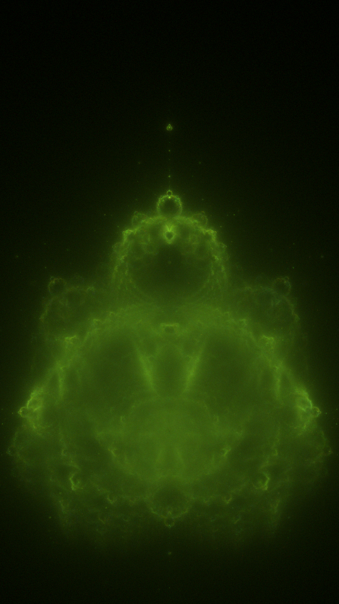

# Buddhabrot

A [Buddhabrot](https://en.wikipedia.org/wiki/Buddhabrot) renderer written in C# .Net.

This is a really slow and naive implementation of this rendering technique, but it works and it produces pretty pictures.

It (obviously) works well with the Mandelbrot function, but it also works well for the Mandelbar/Tricorn formula as well as Multibrot (Mandelbrots to the power of **n**).

~~C# is probably a really shitty language to write this in, I figure that C++ would be light years ahead. Also, don't be like me and run your program in Debug mode. I lost so much time...~~
I did not optimize this properly.

# Renders

# Donate (click the image)

